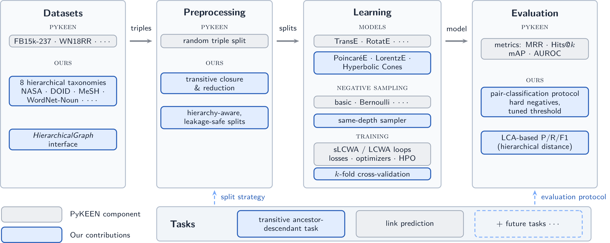

<h1 align="center">
  HiKGE
</h1>

<p align="center">
    <b>HiKGE</b> is a benchmark and framework for <b>hierarchical link prediction</b>. It extends the
    <a href="https://github.com/pykeen/pykeen">PyKEEN</a> knowledge-graph-embedding library with
    hierarchical datasets, dataset analytics, hyperbolic baseline models, hierarchy-specific
    evaluation tasks, and hierarchy-aware metrics.
</p>

<p align="center">
  <a href="#whats-in-hikge">What's in HiKGE</a> •
  <a href="#installation">Installation</a> •
  <a href="#quickstart">Quickstart</a> •
  <a href="#hierarchical-datasets">Datasets</a> •
  <a href="#models">Models</a> •
  <a href="#hierarchy-aware-metrics">Metrics</a> •
  <a href="#reproducing-the-experiments">Reproducing the Experiments</a>
</p>

## What's in HiKGE

<p align="center">
  
</p>

This README documents only what HiKGE adds on top of PyKEEN. In addition to the core PyKEEN
functionality, this repository provides:

- **Hyperbolic baselines** — `PoincareE`, `LorentzE`, and `HyperbolicCones`
  (`pykeen.models`), built on hyperbolic representations and interactions in
  `pykeen.nn.hyperbolic`, plus Riemannian optimizers in `pykeen.optimizers`.
- **Hierarchical datasets** — taxonomy-style graphs (WordNet noun hierarchy, ACM-CCS, DOID, MeSH,
  EuroSciVoc, NASA taxonomy, …) with transitive-closure and metadata utilities in
  `pykeen.datasets.metadata` and `pykeen.datasets.extended_graph_analysis`. Each raw taxonomy
  optionally ships a precomputed transitive closure (`HierarchicalGraph.closure_url`), downloaded
  and reused instead of recomputing the transitive reduction; missing or unreachable, it falls back
  to computing the closure on demand. The `*Transitive0Percent` classes additionally ship a frozen
  ancestor–descendant split whose training portion already includes the direct hierarchy edges and
  whose validation/test portions already hold their share of the (non-direct) transitive closure —
  no split derivation needed at load time.
- **Hierarchy evaluation tasks** — subsumption / pair classification metrics
  (`pykeen.evaluation.pair_classification_evaluator`), transitive ancestor–descendant prediction
  (`pykeen.pipeline.transitive_ancestor_descendant_prediction_pipeline`), and LCA-based
  hierarchical precision/recall/F1 (`pykeen.evaluation.LCAClassificationEvaluator`).
- **Hierarchy-aware training** — hierarchy negative samplers (`pykeen.sampling`)
  and a hierarchy pipeline (`pykeen.pipeline.hierarchy`).
- **k-fold cross-validation** — `pykeen.cross_validation` with k-fold dataset splits.

The import name is `pykeen`, so existing PyKEEN code runs unchanged.

## Installation

Python 3.9+ is required. This package is **not published on PyPI** — `pip install pykeen`
installs upstream PyKEEN, not this one.

Download this repository as a ZIP archive and extract it. Create a virtual environment, then
install from the extracted directory (or pass its path in place of `.`).

With [uv](https://docs.astral.sh/uv/):

```shell
uv venv
source .venv/bin/activate     # Windows: .venv\Scripts\activate
uv pip install -e .
```

Or with pip:

```shell
python3 -m venv .venv
source .venv/bin/activate     # Windows: .venv\Scripts\activate
pip install -e .
```

`uv sync` is an alternative to the uv commands above: it creates `.venv` and installs the exact
versions pinned in the checked-in `uv.lock` rather than resolving fresh.

Verify the installation with:

```shell
pykeen version
```

Extras use bracket notation, e.g. `pip install -e ".[plotting,docs]"`. See the
[installation documentation](https://pykeen.readthedocs.io/en/latest/installation.html) for the
list of extras and for Windows notes.

The import name is `pykeen`, so existing PyKEEN code runs unchanged.

## Quickstart

HiKGE's headline task is **transitive ancestor–descendant prediction**: a model is trained on the
direct hierarchy edges (transitive reduction) and evaluated on the held-out transitive closure — how
well it recovers ancestor–descendant pairs it never saw. The pipeline handles the closure split,
training, and hierarchy-aware evaluation:

```python
from pykeen.models import PoincareE
from pykeen.pipeline.transitive_ancestor_descendant import (
    transitive_ancestor_descendant_prediction_pipeline,
)
from pykeen import datasets

# NASATransitive0Percent ships a frozen ancestor–descendant closure split.
dataset = datasets.NASATransitive0Percent()

result = transitive_ancestor_descendant_prediction_pipeline(
    dataset,
    model=PoincareE,
    model_kwargs={"embedding_dim": 5, "curvature": 1.0},
    epochs=200,
    lca=True,  # also compute the LCA-based hierarchical metrics
)
print(result.ancestor_descendant_metric_results)
print("LCA-F1:", result.lca_metric_results.get_metric("both.lca_f1"))
```

Because `NASATransitive0Percent` declares a predefined closure split, the pipeline reads the exact
train/valid/test pairs from the dataset instead of sampling its own — so results are reproducible
across runs and machines.

## Hierarchical Datasets

HiKGE adds six taxonomies from distinct domains. Each ships as a raw hierarchy plus a
`*Transitive0Percent` variant carrying a **frozen ancestor–descendant closure split** (training holds
the direct edges, validation/test hold their share of the non-direct transitive closure), so no split
derivation happens at load time.

| Name                           | Class                                        | Citation                                                                                                            | Entities | Relations | Triples |
|--------------------------------|----------------------------------------------|---------------------------------------------------------------------------------------------------------------------|----------|-----------|---------|
| NASA Technology Taxonomy       | `pykeen.datasets.NASA`                       | [NASA, 2024](https://www.nasa.gov/technology/technology-taxonomy/)                                                   | 495      | 1         | 478     |
| — closure split                | `pykeen.datasets.NASATransitive0Percent`     | [NASA, 2024](https://www.nasa.gov/technology/technology-taxonomy/)                                                   | 495      | 1         | 516     |
| EuroSciVoc                     | `pykeen.datasets.EuroSciVoc`                 | [EU Publications Office, 2019](https://op.europa.eu/en/web/eu-vocabularies/euroscivoc)                              | 1065     | 2         | 1064    |
| — closure split                | `pykeen.datasets.EuroSciVocTransitive0Percent` | [EU Publications Office, 2019](https://op.europa.eu/en/web/eu-vocabularies/euroscivoc)                            | 1064     | 1         | 1270    |
| ACM-CCS                        | `pykeen.datasets.ACMCCS`                     | [ACM, 2012](https://www.acm.org/publications/class-2012)                                                            | 2114     | 2         | 2113    |
| — closure split                | `pykeen.datasets.ACMCCSTransitive0Percent`   | [ACM, 2012](https://www.acm.org/publications/class-2012)                                                            | 2113     | 1         | 2490    |
| MeSH                           | `pykeen.datasets.MeSH`                       | [National Library of Medicine, 2024](https://www.nlm.nih.gov/mesh/meshhome.html)                                    | 30837    | 3         | 56383   |
| — closure split                | `pykeen.datasets.MeSHTransitive0Percent`     | [National Library of Medicine, 2024](https://www.nlm.nih.gov/mesh/meshhome.html)                                    | 30837    | 1         | 59408   |
| DOID (Human Disease Ontology)  | `pykeen.datasets.DOID`                       | [DiseaseOntology, 2024](https://github.com/DiseaseOntology/HumanDiseaseOntology)                                    | 12221    | 2         | 17410   |
| — closure split                | `pykeen.datasets.DOIDTransitive0Percent`     | [DiseaseOntology, 2024](https://github.com/DiseaseOntology/HumanDiseaseOntology)                                    | 12190    | 1         | 16186   |
| WordNet-Noun (0%)              | `pykeen.datasets.WordNetNoun0Percent`        | [Ganea *et al.*, 2018](https://arxiv.org/abs/1804.01882)                                                            | 82114    | 1         | 142039  |
| WordNet-Noun (10%)             | `pykeen.datasets.WordNetNoun10Percent`       | [Ganea *et al.*, 2018](https://arxiv.org/abs/1804.01882)                                                            | 82114    | 1         | 199715  |
| WordNet-Noun (25%)             | `pykeen.datasets.WordNetNoun25Percent`       | [Ganea *et al.*, 2018](https://arxiv.org/abs/1804.01882)                                                            | 82114    | 1         | 286230  |
| WordNet-Noun (50%)             | `pykeen.datasets.WordNetNoun50Percent`       | [Ganea *et al.*, 2018](https://arxiv.org/abs/1804.01882)                                                            | 82114    | 1         | 430421  |
| WordNet-Noun (90%)             | `pykeen.datasets.WordNetNoun90Percent`       | [Ganea *et al.*, 2018](https://arxiv.org/abs/1804.01882)                                                            | 82114    | 1         | 661126  |

The WordNet-Noun family is the fixed noun-hypernymy split of Ganea et al. (2018); the percentage is
the fraction of the transitive closure added to training (0% = direct edges only).

### Dataset Analytics

For every dataset (including newly added ones), HiKGE computes a set of analytics over the
hierarchical subgraph via `pykeen.datasets.extended_graph_analysis`: number of nodes, hierarchy
edges, hierarchy roots and leaves, the node **depth** δ(v) (distance from the nearest root) and
**branch-out** d⁺(v) (out-degree of internal nodes) with their mean and maximum, and the J¹ **balance
index** measuring how balanced the hierarchy is (0 = degenerate, 1 = perfectly balanced).

With $d^-(v)$ and $d^+(v)$ the in- and out-degree of a node $v$, the **roots** are the nodes that never
appear as a tail and the **leaves** those that never appear as a head:

$$R = \{v \in V \mid d^-(v) = 0\}, \qquad L = \{v \in V \mid d^+(v) = 0\}$$

The node **depth** $\delta(v)$ is the shortest-path distance to the nearest root (roots at depth 0);
HiKGE reports its minimum, mean, and maximum over all nodes:

$$\delta(v) = \min_{r \in R} d(r, v), \qquad
\text{depth}_{\min/\text{avg}/\max} = \min_{v \in V} \delta(v),\ \frac{1}{|V|}\sum_{v \in V} \delta(v),\ \max_{v \in V} \delta(v)$$

The **branch-out** is the out-degree of the internal (non-leaf) nodes $\widetilde{V} = \{v \in V \mid d^+(v) \ge 1\}$,
reported as a mean/min/max:

$$\text{branch-out}_{\text{avg}} = \frac{1}{|\widetilde{V}|} \sum_{v \in \widetilde{V}} d^+(v), \qquad
\text{branch-out}_{\min/\max} = \min_{v \in \widetilde{V}} d^+(v),\ \max_{v \in \widetilde{V}} d^+(v)$$

The J¹ **balance index** ([Lemant *et al.*, 2022](https://doi.org/10.1093/sysbio/syac027), Eq. 5) is a leaf-weighted average of the normalised
Shannon entropies of the internal nodes, where $C(i)$ are the children of node $i$ and $n_i$ is the
number of leaves in the subtree rooted at $i$. It is intrinsically normalised to $[0, 1]$ (0 for a
linear/degenerate graph, 1 for a fully symmetric tree); its denominator is exactly Sackin's index:

$$J^1(T) = \frac{-1}{\sum_{i \in \widetilde{V}} n_i} \sum_{i \in \widetilde{V}} \sum_{j \in C(i)} n_j \, \log_{d^+(i)} \frac{n_j}{n_i}$$

```python
from pykeen.datasets import NASA
from pykeen.datasets.extended_graph_analysis import ExtendedGraphAnalysis

analysis = ExtendedGraphAnalysis(NASA())

print("nodes:      ", analysis.num_entities)
print("edges:      ", analysis.unique_edges)
print("roots/leaves:", len(analysis.root_nodes), "/", len(analysis.leaf_nodes))
print("depth (avg/max):", analysis.avg_hierarchy_depth, "/", analysis.max_hierarchy_depth)
print("branch-out (avg/max):", analysis.avg_branch_out, "/", analysis.max_branch_out)
print("balance (J¹):", analysis.balance)
```

## Models

HiKGE adds three hyperbolic baseline models for hierarchical representation learning. RotatE is
used as the non-hierarchical (Euclidean) reference baseline in the experiments.

| Name            | Class                             | Manifold                          | Citation                                                        |
|-----------------|-----------------------------------|-----------------------------------|-----------------------------------------------------------------|
| PoincareE       | `pykeen.models.PoincareE`         | Poincaré ball                     | [Nickel & Kiela, 2017](https://arxiv.org/abs/1705.08039)        |
| LorentzE        | `pykeen.models.LorentzE`          | Lorentz (hyperboloid)             | [Nickel & Kiela, 2018](https://arxiv.org/abs/1806.03417)        |
| HyperbolicCones | `pykeen.models.HyperbolicCones`   | Poincaré ball + entailment cones  | [Ganea *et al.*, 2018](https://arxiv.org/abs/1804.01882)        |

The corresponding representations (`pykeen.nn.PoincareEmbedding`, `pykeen.nn.LorentzEmbedding`,
`pykeen.nn.HyperbolicConesEmbedding`) and interactions (`pykeen.nn.PoincareEInteraction`,
`pykeen.nn.LorentzInteraction`, `pykeen.nn.HyperbolicConesInteraction`) live in
`pykeen.nn.hyperbolic`, backed by Riemannian optimizers in `pykeen.optimizers`.

## Evaluation Tasks

HiKGE adds hierarchy-specific evaluation tasks on top of standard link prediction:

- **Transitive ancestor–descendant prediction** —
  `pykeen.pipeline.transitive_ancestor_descendant_prediction_pipeline`. Train on the transitive
  reduction of the hierarchy (plus an optional fraction α of the closure) and predict the held-out
  closure edges. Both random and hard (same-depth "near-miss") negatives are supported. Held-out
  pairs are scored against their sampled negatives and reported as pair-classification metrics
  (precision/recall/F1/mAP/AUROC) via `pykeen.evaluation.pair_classification_evaluator`.

Hierarchy-aware negative samplers back this task: `pykeen.sampling.HierarchyNegativeSampler`
(corrupts a hierarchy edge with a node at the *same depth*) and
`pykeen.sampling.SiblingNegativeSampler` (pairs an entity with its own sibling).

## Hierarchy-aware Metrics

HiKGE adds LCA-based hierarchical classification metrics via
`pykeen.evaluation.LCAClassificationEvaluator`. These give partial credit for predictions that land
*near* the true node in the hierarchy — a sibling of the correct descendant scores higher than a
distant sub-tree — by augmenting the true and predicted node sets with the paths to their lowest
common ancestor (Kosmopoulos et al. 2015).

| Name          | Interval | Direction | Description                                                             |
|---------------|----------|-----------|-------------------------------------------------------------------------|
| LCA Precision | [0, 1]   | 📈        | Precision of the LCA-augmented predicted node set.                      |
| LCA Recall    | [0, 1]   | 📈        | Recall of the LCA-augmented true node set.                              |
| LCA F1        | [0, 1]   | 📈        | Harmonic mean of LCA precision and recall.                              |

These complement the standard PyKEEN rank-based and classification metrics (MRR, mAP, AUROC, F1)
used throughout the benchmark.

## Reproducing the Experiments

The preliminary results in the paper (transitive ancestor–descendant task, closure ratio 0, on all
six datasets) are produced by the benchmarking scripts under `benchmarking/`. They run every baseline
(PoincareE, LorentzE, HyperbolicCones, and RotatE) against every dataset using the **predefined
closure splits**, so runs are reproducible.

```shell
uv run python benchmarking/benchmark_transitive_ancestor_descendant.py
```

Per-run metrics are written to
`benchmarking/results/transitive-ancestor-descendant/<run_stamp>/<dataset>/<config>.json` and an
aggregated cross-run table to `.../<run_stamp>/summary.csv`. Key settings (embedding dimension,
epochs, seed, negatives, alpha grid) are the constants at the top of the script.

HiKGE is built on top of [PyKEEN](https://github.com/pykeen/pykeen).
